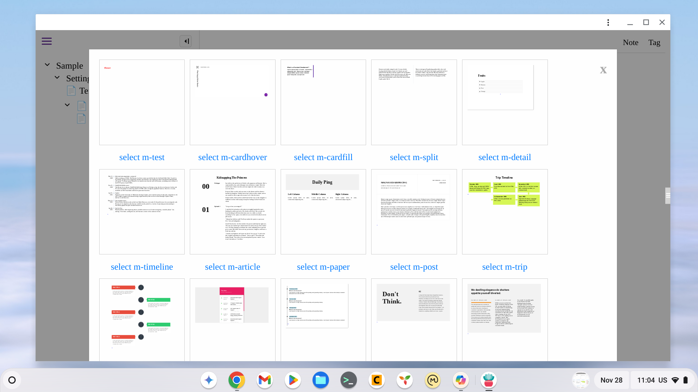

# tippy

a local first note app with interesting and convenient features (growing):
- local first web app, which can run in browser or installed local
- use outliner and tab/note organzing info
- very light and small (try to use minimum code only)
- rich editor via pell (please highlight text to edit first and a panel will popup)
- react both in destop and mobile via vanjs
- support of copy/paste note within the same file, or export/import cross files (use menu)
- support of clojurescript via scittle with basic code editing/highlighting functions
- support of template (try example: download Sample.json, open it in the web app, and navigate to Setting/autorun then go to saveConfig note, click run button, and reload the webapp and use tag menu)
- very customizable via clojurescript (see Sample.json for example...will elaborate more in future)

[try or install](https://kangaroolab.github.io/tippy/): please also download demo.json, open it in tippy and follow note "to use demo.json".

## story behind
I haven been a big fan of outliner and rich text editor in browser to organize information. This note app started as my pilot when I experimented coding with LLM/ChatGPT, which turned out to be quite intereting experience (happy to share separately). Instead of just a pilot, I actually started using it on a daily basis as my note app. Soon after, I started wondering if I could program Clojure(script) with it, of which I am also a big fan. So I enhanced it with scittle, a great tool/module that translates Clojurescript to javascript and executes it in browser. Along programming Clojurescript in this note app, I asked myself why don't I just use it to enhance and enrich the note app itself. My first attempt is to utilize html template to create custom element that can be used to host and edit content with pre-defined format (e.g. card) in the note app without any programming. I am actively testing it and planning to make it available soon.

## credit
inspired by and leveraged followings
- vanjs: https://github.com/vanjs-org/van
- van element: https://github.com/Atmos4/van-element
- pell editor: https://github.com/jaredreich/pell
- scittle: https://github.com/babashka/scittle
